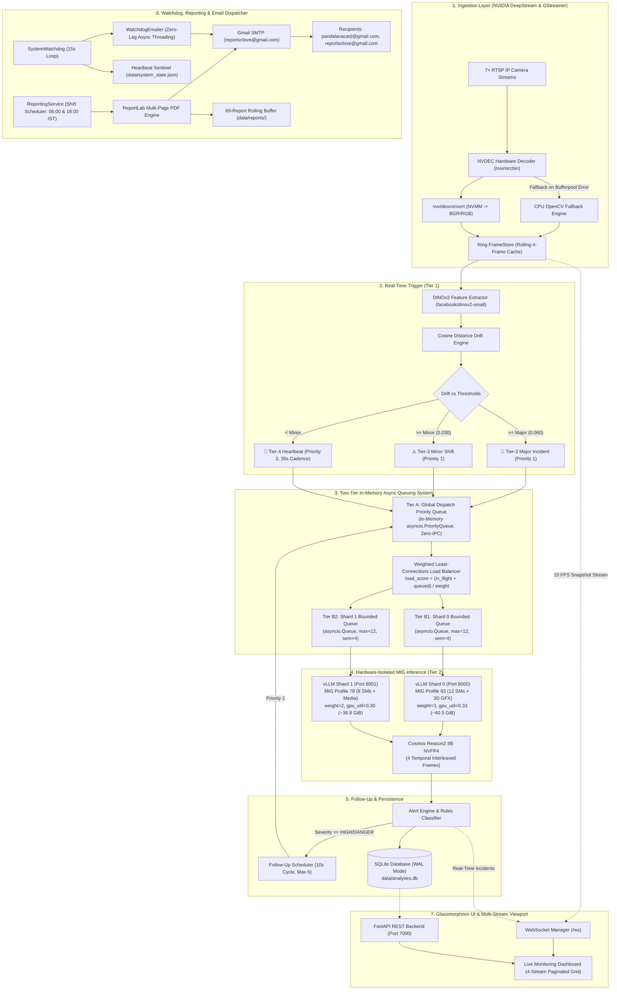
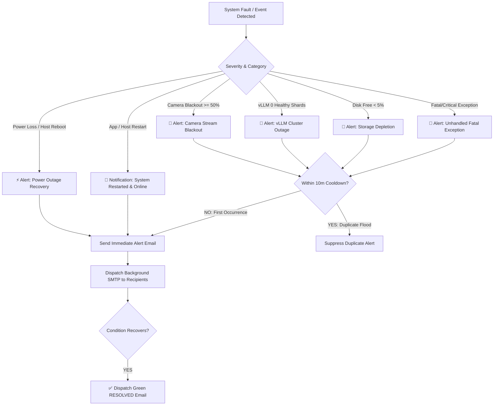

# ⚡ RapidAlert: Hybrid VLM Edge Surveillance Engine
### Autonomous Multi-Camera Reasoning & Dual-Tier Scene Shift Intelligence on NVIDIA Jetson AGX Thor

[](https://www.nvidia.com)
[-blueviolet)](https://huggingface.co/vrfai/Cosmos-Reason2-8B-NVFP4)
[-06B6D4)](#-dual-tier-visual-intelligence-pipeline)
[](#-nvidia-thor-mig-partitioning-deepdive)
[](#-two-tier-in-memory-queuing--load-balancing-system)
[](#-automated-health-watchdog--real-time-alerting)
[](#-automated-shift-reporting--pdf-generation)
[-green)](https://github.com/vllm-project/vllm)

RapidAlert is an enterprise-grade, edge-native surveillance platform engineered specifically for **NVIDIA Jetson AGX Thor**. It bridges real-time GStreamer/NVDEC hardware camera ingestion and microsecond visual embedding drift detection with deep multimodal reasoning from **Cosmos Reason2 8B (NVFP4)** across partitioned **Multi-Instance GPU (MIG)** compute shards.

---

## 📑 Table of Contents

1. [Architectural Overview](#-architectural-overview)
2. [Dual-Tier Visual Intelligence Pipeline](#-dual-tier-visual-intelligence-pipeline)
   - [Tier 1: Real-Time Scene Trigger (DINOv2)](#tier-1-real-time-scene-trigger-dinov2)
   - [Tier 2: Temporal Multi-Frame Reasoning (Cosmos Reason2 8B)](#tier-2-temporal-multi-frame-reasoning-cosmos-reason2-8b)
3. [Two-Tier In-Memory Queuing & Load Balancing System](#-two-tier-in-memory-queuing--load-balancing-system)
   - [Tier A: Global Dispatch Priority Queue (`PriorityQueue`)](#tier-a-global-dispatch-priority-queue-priorityqueue)
   - [Tier B: Per-MIG Endpoint Worker Shard Queues (`_EndpointShard`)](#tier-b-per-mig-endpoint-worker-shard-queues-_endpointshard)
   - [Deadlock Prevention & In-Flight Lock Deduplication](#deadlock-prevention--in-flight-lock-deduplication)
   - [Cold-Boot Model Warmup & Circuit Breaking](#cold-boot-model-warmup--circuit-breaking)
4. [NVIDIA Thor Hardware & Unified Memory Architecture](#-nvidia-thor-hardware--unified-memory-architecture)
   - [Unified Memory Dynamics](#unified-memory-dynamics)
   - [RAM Budgeting & KV Cache Sizing](#ram-budgeting--kv-cache-sizing)
   - [Dynamic GPU Activity Calculation (NVML Power Curve)](#dynamic-gpu-activity-calculation-nvml-power-curve)
5. [NVIDIA Thor MIG Partitioning Deepdive](#-nvidia-thor-mig-partitioning-deepdive)
   - [Hardware Slices (Profile 83 + Profile 78)](#hardware-slices-profile-83--profile-78)
   - [Container Device Interface (CDI) & Device Capabilities](#container-device-interface-cdi--device-capabilities)
6. [Autonomous Scheduler & Follow-Up Lifecycle](#-autonomous-scheduler--follow-up-lifecycle)
7. [Automated Health Watchdog & Real-Time Alerting](#-automated-health-watchdog--real-time-alerting)
   - [Real-Time Critical Incident Alerting](#real-time-critical-incident-alerting)
   - [Hardware Sentinel & Power Outage / Crash Detection](#hardware-sentinel--power-outage--crash-detection)
   - [System Restarts & Thor Hardware Reboot Notifications](#system-restarts--thor-hardware-reboot-notifications)
   - [24-Hour Automated System Health & Diagnostics Digest](#24-hour-automated-system-health--diagnostics-digest)
8. [Automated Shift Reporting & PDF Generation](#-automated-shift-reporting--pdf-generation)
   - [Scheduled Shift Reports (06:00 AM & 06:00 PM IST)](#scheduled-shift-reports-0600-am--0600-pm-ist)
   - [Executive PDF Report Architecture (ReportLab)](#executive-pdf-report-architecture-reportlab)
   - [69-Report Rolling Circular Buffer Storage](#69-report-rolling-circular-buffer-storage)
9. [Fault Tolerance & Structured Error Tracking](#-fault-tolerance--structured-error-tracking)
   - [Structured Error Logging & Downstream Effect Tracing](#structured-error-logging--downstream-effect-tracing)
   - [Automated Pre-Flight System Auditor](#automated-pre-flight-system-auditor)
10. [Frontend Architecture & Multi-Stream Viewport](#-frontend-architecture--multi-stream-viewport)
11. [Configuration Reference](#-configuration-reference)
12. [REST API Specification](#-rest-api-specification)
13. [Deployment & Operations Guide](#-deployment--operations-guide)

---

## 🏗️ Architectural Overview



---

## 🧠 Dual-Tier Visual Intelligence Pipeline

### Tier 1: Real-Time Scene Trigger (DINOv2)
* **Model**: `facebook/dinov2-small` (384-dimensional dense visual representations).
* **Execution Latency**: **~8–12 ms** per frame on CPU.
* **Mechanism**:
  1. Ingests full-frame camera snapshots directly from physical memory.
  2. Compares the current spatial embedding $E_t$ against moving baseline embedding $E_{\text{baseline}}$ using normalized Cosine Distance:
     $$\text{Drift}(t) = 1 - \frac{E_t \cdot E_{\text{baseline}}}{\|E_t\|_2 \|E_{\text{baseline}}\|_2}$$
  3. **Multi-Threshold Decision Tree**:
     * **Major Incident (Priority 1)**: $\text{Drift} \ge \text{dino\_major\_threshold}$ (Default: `0.060`). Dispatches emergency multimodal reasoning immediately.
     * **Minor Scene Shift (Priority 1)**: $\text{Drift} \ge \text{dino\_minor\_threshold}$ (Default: `0.030`). Captures perimeter breaches, unauthorized movement, or physical layout alterations.
     * **Periodic Heartbeat (Priority 3)**: Routine ambient inspection every 35s.

### Tier 2: Temporal Multi-Frame Reasoning (Cosmos Reason2 8B)
* **Model**: `vrfai/Cosmos-Reason2-8B-NVFP4` running on **vLLM 0.19.0** with PagedAttention.
* **Hardware Weights**: NVIDIA NVFP4 quantization (4-bit floating point weights with FP8 activations).
* **Temporal Attention Sequence**:
  Captures **4 ordered temporal snapshots** ($t-10s, t-6.5s, t-3s, t-0s$) interleaved with explicit contextual vision anchors:
  ```json
  [
    {"type": "text", "text": "Frame 1 (t -10.0s):"},
    {"type": "image_url", "image_url": {"url": "data:image/jpeg;base64,..."}},
    {"type": "text", "text": "Frame 2 (t -6.5s):"},
    {"type": "image_url", "image_url": {"url": "data:image/jpeg;base64,..."}},
    {"type": "text", "text": "Frame 3 (t -3.0s):"},
    {"type": "image_url", "image_url": {"url": "data:image/jpeg;base64,..."}},
    {"type": "text", "text": "Frame 4 (t 0.0s - CURRENT TRIGGER):"},
    {"type": "image_url", "image_url": {"url": "data:image/jpeg;base64,..."}},
    {"type": "text", "text": "Analyze the temporal sequence across these 4 surveillance frames. Identify what initiated the scene shift, who is involved, and classify safety hazards."}
  ]
  ```
* **Structured Output Schema**:
  ```json
  {
    "observation": "Worker in blue overalls tripped near open high-voltage panel at t-1.",
    "severity": "HIGH",
    "safety": "DANGER",
    "workers": "2",
    "machinery": "Open High-Voltage Distribution Board",
    "activity": "Fall Hazard / Electrical Exposure",
    "evolution": "Deteriorating"
  }
  ```

---

## 🚦 Two-Tier In-Memory Queuing & Load Balancing System

RapidAlert implements a **pure in-memory, zero-IPC async queuing hierarchy** designed specifically for edge system-on-chips (eliminating Redis/RabbitMQ network hop latency and RAM footprint):

```
                        [ DINOv2 / Timer / API Events ]
                                       │
                                       ▼
    ┌─────────────────────────────────────────────────────────────────────┐
    │     Tier A: Global Dispatch Priority Queue (PriorityQueue)          │
    │     • Priority 1: Instant Scene Shift & Trigger Events (P1)         │
    │     • Priority 2: 10s Adaptive Follow-up Verification (P2)          │
    │     • Priority 3: Routine Ambient Heartbeat Audits (P3)             │
    └──────────────────────────────────┬──────────────────────────────────┘
                                       │  Deadlock Prevention: In-Flight Lock Set
                                       ▼
    ┌─────────────────────────────────────────────────────────────────────┐
    │     Weighted Least-Connections Load Balancer (MIGAwareVLMPool)      │
    │                                                                     │
    │                 load_score = (in_flight + queued) / weight          │
    └──────────────────┬───────────────────────────────┬──────────────────┘
                       │ (weight=3)                    │ (weight=2)
                       ▼                               ▼
    ┌────────────────────────────────────┐ ┌────────────────────────────────────┐
    │ Tier B1: Shard 0 Bounded Queue     │ │ Tier B2: Shard 1 Bounded Queue     │
    │ • asyncio.Queue (maxsize=12)       │ │ • asyncio.Queue (maxsize=12)       │
    │ • asyncio.Semaphore (max=4)        │ │ • asyncio.Semaphore (max=4)        │
    │ • 4 Coroutine Workers (Port 8000)  │ │ • 4 Coroutine Workers (Port 8001)  │
    └────────────────────────────────────┘ └────────────────────────────────────┘
```

### Tier A: Global Dispatch Priority Queue (`PriorityQueue`)
* **Module**: [`backend/services/priority_queue.py`](file:///home/clove/RapidAlert/backend/services/priority_queue.py)
* **Underlying Structure**: Python standard `asyncio.PriorityQueue` storing `(priority_int, timestamp, job_payload)`.
* **Priority Tiers**:
  * `Priority 1 (TRIGGER)`: Instant scene shifts detected by DINOv2 threshold breaches or manual trigger injections. Bypasses all periodic jobs.
  * `Priority 2 (FOLLOWUP)`: Scheduled 10-second verification cycles for active incidents. Ensures continuity of scene analysis without starvation.
  * `Priority 3 (PERIODIC / HEARTBEAT)`: Low-priority routine checks scheduled every ~35 seconds. Yields immediately when scene shifts occur.

### Tier B: Per-MIG Endpoint Worker Shard Queues (`_EndpointShard`)
* **Module**: [`backend/services/vlm_client.py`](file:///home/clove/RapidAlert/backend/services/vlm_client.py)
* **Queue Structure**: Dedicated `asyncio.Queue(maxsize=queue_depth)` per vLLM instance (default `maxsize=12`).
* **Concurrency Cap**: `asyncio.Semaphore(max_concurrent=4)` prevents overloading the vLLM PagedAttention KV-cache.
* **Hardware-Weighted Load Scoring**:
  $$\text{Load Score} = \frac{\text{In-Flight Requests} + \text{Queue Depth}}{\text{Shard Compute Weight}}$$
  * **Shard 0 (Port 8000, 12 SMs)**: `weight = 3`
  * **Shard 1 (Port 8001, 8 SMs)**: `weight = 2`
  * **Mathematical Property**: Shard 0 receives **60% of the inference volume** and Shard 1 receives **40%**, perfectly matching the physical compute split on Jetson Thor silicon.

### Deadlock Prevention & In-Flight Lock Deduplication
* **Per-Camera In-Flight Locking**: The scheduler maintains an atomic `_in_flight: set[str]` tracking cameras actively under inference.
* If a new scene shift trigger fires while an inference is already running for Camera A, the trigger updates Camera A's latest frame timestamp in memory without generating duplicate queue entries, preventing queue stampedes.

### Cold-Boot Model Warmup & Circuit Breaking
* **Graceful Cold-Boot Handling**: On startup, vLLM weights take 60–90 seconds to load into GPU VRAM. `MIGAwareVLMPool` initializes `healthy = False` and checks `has_healthy_shards()`.
* **Zero Error Storms**: Jobs dispatched during warmup receive a clean, non-crashing payload (`"verdict": "WARMUP"`, `"observation": "VLM Model Initializing (Warmup in progress)..."`) without throwing connection exceptions into error logs.
* **Auto-Recovery**: As soon as HTTP `/health` reports `200 OK`, worker queues open and inference commences immediately.

---

## 💾 NVIDIA Thor Hardware & Unified Memory Architecture

### Unified Memory Dynamics
NVIDIA Jetson AGX Thor utilizes a **Unified LPDDR5X Memory Architecture** (128 GB total physical RAM):
* **CPU and GPU share the same 128 GB memory bus** (over 200 GB/s bandwidth).
* CUDA allocations (weights, activations, PagedAttention KV-caches, NVDEC frame pools) directly claim physical LPDDR5X system RAM.

### RAM Budgeting & KV Cache Sizing
To prevent Out-Of-Memory (`OOM-killer`) kernel panics while maximizing parallel inference throughput:

| Component | Physical RAM Allocated | Configuration Parameter | Purpose |
| :--- | :--- | :--- | :--- |
| **vLLM Shard 0** (Port 8000) | **~40.5 GiB** | `"gpu_utilization": 0.33` | Model weights (7.35 GiB) + 33.15 GiB KV cache on 12-SM shard |
| **vLLM Shard 1** (Port 8001) | **~36.8 GiB** | `"gpu_utilization": 0.30` | Model weights (7.35 GiB) + 29.45 GiB KV cache on 8-SM shard |
| **RapidAlert Backend** | **~21.0 GiB** | Internal | DINOv2 PyTorch model + 7× DeepStream 4K frame ring buffers |
| **OS, Xorg & Desktop GUI** | **~8.0 GiB** | System | GNOME Shell, Xorg, Display server, background daemons |
| **Uncommitted Headroom** | **~16.5 GiB** | Free Memory | Safety buffer for burst concurrency and memory spikes |
| **Total System Memory** | **122.8 GiB (128 GB)** | — | **100% stable, zero OOM risk** |

### Dynamic GPU Activity Calculation (NVML Power Curve)
Under Jetson Thor MIG mode, traditional static GPU utilization metrics report partitioned sub-slices. RapidAlert implements an accurate **Dynamic Power-Curve GPU Utilization Engine** ([`metrics_monitor.py`](file:///home/clove/RapidAlert/backend/services/metrics_monitor.py)):
$$\text{GPU Activity } (\%) = \min\left(100, \max\left(0, \frac{\text{Power}_{\text{NVML}} - P_{\text{idle}}}{P_{\text{max}} - P_{\text{idle}}} \times 100\right)\right)$$
* $P_{\text{idle}} = 18.0\text{ W}$ (Idle base load).
* $P_{\text{max}} = 120.0\text{ W}$ (Full compute saturation under Dual-MIG inference).

---

## ⚡ NVIDIA Thor MIG Partitioning Deepdive

### Hardware Slices (Profile 83 + Profile 78)
NVIDIA Thor possesses **20 Streaming Multiprocessors (SMs)** partitioned into two isolated physical slices:

```
┌─────────────────────────────────────────────────────────────────────────────┐
│                       NVIDIA AGX THOR SILICON (20 SMs)                      │
├──────────────────────────────────────────────┬──────────────────────────────┤
│       Profile 83: MIG 2g.0gb+gfx (12 SMs)    │ Profile 78: MIG 1g.0gb+me (8 SMs) │
├──────────────────────────────────────────────┼──────────────────────────────┤
│ • 12 CUDA Streaming Multiprocessors         │ • 6 Active CUDA Compute SMs  │
│ • 3D Graphics & Vulkan/OpenGL Engine         │ • 2 Hardware Media Controllers│
│ • Display Engine / Xorg / Desktop Attached   │ • 1× NVDEC (Hardware 4K Dec) │
│ • vLLM Instance 0 (Port 8000)                │ • 1× NVENC (Hardware 4K Enc) │
│ • RapidAlert Backend (DINOv2 + NVMM)        │ • 1× OFA (Optical Flow Accel)│
│                                              │ • 1× JPEG Hardware Decoder   │
│                                              │ • vLLM Instance 1 (Port 8001)│
└──────────────────────────────────────────────┴──────────────────────────────┘
```

### Container Device Interface (CDI) & Device Capabilities
On Jetson Linux in CDI CSV mode, passing raw MIG UUIDs causes OCI shim failures. RapidAlert resolves this by dynamically mapping capability device nodes:
* **Shard 0 (`rapidalert_vllm_0`)**: Maps `/dev/nvidia-caps/nvidia-cap1*` with `CUDA_VISIBLE_DEVICES=0`.
* **Shard 1 (`rapidalert_vllm_1`)**: Maps `/dev/nvidia-caps/nvidia-cap2*` with `CUDA_VISIBLE_DEVICES=0`.

---

## 🛡️ Automated Health Watchdog & Real-Time Alerting

RapidAlert integrates a dedicated **Autonomous System Health Watchdog & Alerting Engine** ([`watchdog_emailer.py`](file:///home/clove/RapidAlert/backend/services/watchdog_emailer.py) & [`watchdog.py`](file:///home/clove/RapidAlert/backend/services/watchdog.py)) that provides continuous zero-lag background monitoring, automatic incident mitigation, and automated executive email alerting.

### Real-Time Critical Incident Alerting

When high-severity faults occur, `WatchdogEmailer` immediately renders executive HTML alert templates and delivers them via Gmail SMTP with anti-spam deduplication (10-minute cooldown per incident category) and automatic **`[RESOLVED]`** follow-up notices upon recovery:



| Alert Category | Trigger Condition | Notification Type | Auto-Recovery Notification |
| :--- | :--- | :--- | :--- |
| **🚨 Camera Stream Blackout** | $\ge 50\%$ of active feeds frozen / staleness $>15\text{s}$ | `CRITICAL` | Dispatched when all feeds resume 30 FPS ingestion |
| **🚨 vLLM Cluster Outage** | 0 healthy inference shards available across GPU instances | `CRITICAL` | Dispatched when shards return healthy |
| **🚨 Fatal Exceptions / Crashes** | Any unhandled `CRITICAL`/`FATAL` exception in core pipeline | `CRITICAL` | Includes full stack trace, caller file & line number |
| **🚨 Storage Depletion** | Host storage free space drops below $5\%$ | `CRITICAL` | Dispatched when disk space normalizes $\ge 10\%$ |
| **⚡ Power Outage Recovery** | Machine restarted after ungraceful shutdown / power loss | `CRITICAL` | Detailed outage downtime calculation |
| **⚡ Thor Hardware Reboot** | NVIDIA Thor host was rebooted (clean or maintenance) | `INFO` / `RESTART` | Executive host online notification |
| **🔄 Application Restart** | RapidAlert program restarted (e.g. `./run.sh` re-run) | `INFO` / `RESTART` | Process PID & operational feed status |

### Hardware Sentinel & Power Outage / Crash Detection

To reliably distinguish between an unexpected power cut, a kernel panic, a process crash, and a clean administrative restart, RapidAlert uses a **Sentinel State File** (`data/system_state.json`) coupled with Linux kernel boot time inspection (`/proc/uptime`):

1. **Physical Power Outage / Hard Host Reboot**:
   - On startup, the Linux kernel boot timestamp $T_{\text{boot}}$ is compared against the prior run's last heartbeat $T_{\text{last\_hb}}$.
   - If $T_{\text{boot}} > T_{\text{last\_hb}}$, the physical machine lost power or suffered a hardware reset.
   - **Calculated Metrics**: Downtime duration ($T_{\text{now}} - T_{\text{last\_hb}}$), last active heartbeat timestamp, host reboot time.
   - **Email Subject**: `⚡ [RAPIDALERT CRITICAL] Power Outage Recovery: RapidAlert Re-established`
2. **Process Crash / Kernel OOM / Sudden Kill**:
   - If the host machine remained on ($T_{\text{boot}} \le T_{\text{last\_hb}}$) but the prior state was `RUNNING` (never reached clean shutdown).
   - **Email Subject**: `⚠️ [RAPIDALERT CRITICAL] Crash Recovery: RapidAlert Restarted After Unexpected Termination`
3. **Graceful Application Restart**:
   - Lifespan writes `CLEAN_SHUTDOWN` to the sentinel file on exit (`Ctrl+C` or `SIGTERM`).
   - Upon next boot, RapidAlert recognizes the graceful shutdown and sends a clean **System Restart Notification** without false alarms.
4. **15-Second Rolling Heartbeat**:
   - While running, `SystemWatchdog` updates `last_heartbeat` in `data/system_state.json` every **15 seconds** via `heartbeat_tick()`.

### 24-Hour Automated System Health & Diagnostics Digest

Scheduled automatically every day at **08:00 AM IST** (customizable via `config/system.json`), compiling a comprehensive executive digest:
* **24-Hour Error & Exception Audit**: Aggregates SQLite `error_logs` into Critical, Standard, and Warning categories with top recent error traces.
* **Threat & Incident Metrics**: Total VLM analyses performed, High-severity hazards, and Medium incidents detected.
* **Camera & Hardware Telemetry**: Active camera counts, NVDEC hardware vs. CPU-OpenCV fallback distribution, and vLLM shard health.
* **PDF Shift Report Audit**: Summary of automated PDF reports generated and emailed during the period.

---

## 📊 Automated Shift Reporting & PDF Generation

RapidAlert features an enterprise-grade automated reporting subsystem ([`reporting_service.py`](file:///home/clove/RapidAlert/backend/services/reporting_service.py)) built on ReportLab that generates polished, corporate-branded shift intelligence reports:

### Scheduled Shift Reports (06:00 AM & 06:00 PM IST)
* **Shift Cycles**:
  * **Day Shift Report**: 06:00 AM – 06:00 PM IST (Generated at 18:00 IST).
  * **Night Shift Report**: 06:00 PM – 06:00 AM IST (Generated at 06:00 IST).
* **Automated Email Delivery**: Dispatched as high-resolution PDF attachments to configured recipients (`pandalavacarji@gmail.com` and `reportsclove@gmail.com`).

### Executive PDF Report Architecture (ReportLab)
* **Visual Design System**: Corporate navy theme with primary `#1e3a8a`, accent `#dc2626`, and subtle `#f8fafc` styling.
* **Key Executive Sections**:
  1. **Header & Metadata**: Shift type, date range, total analyses performed, and site ID.
  2. **Executive KPI Cards**: Total threat counts, High severity hazard counts, Medium alerts, and camera uptime rate.
  3. **High / Danger Incident Deep-Dives**: Detailed cards for critical incidents complete with camera name, timestamp, observation narrative, detected safety hazard, and embedded camera visual snapshots.
  4. **Chronological Activity Log**: Structured table recording significant scene shifts and detections across all 7 cameras.
* **Dynamic Page Budgeting & Zero Cutoff**:
  - Implements an intelligent auto-pagination algorithm (`_build_pdf()`) that measures content heights and injects `PageBreak()` elements dynamically.
  - Guarantees zero text truncation, zero image overlap, and perfectly balanced multi-page layout.

### 69-Report Rolling Circular Buffer Storage
* **Retention Capacity**: Maintains a rolling buffer of **69 shift reports** in `data/reports/` (~**34.5 days of continuous history**).
* **Storage Footprint**: Consumes less than **25 MB** total disk space (~300–400 KB per PDF).
* **Automated Pruning**: Once the buffer exceeds 69 reports, oldest reports are pruned automatically.
* **Interactive UI Access**: Access historical shift reports directly from the **Shift Reports Modal** on the top navigation bar.

---

## 🛠️ Fault Tolerance & Structured Error Tracking

### Structured Error Logging & Downstream Effect Tracing
To completely eliminate silent error swallowing, RapidAlert routes all exceptions through [`error_tracker.py`](file:///home/clove/RapidAlert/backend/core/error_tracker.py):
* **Captured Metadata**: Error Type, Caller File & Line Number, Function Name, Camera Context, Message, and **Downstream Operational Effect**.
* **Dual Persistence**: Stored in an in-memory circular deque (300 records) and persisted to SQLite `error_logs` table (WAL mode).
* **Live WebSocket Broadcast**: Dispatches error payloads directly to the frontend Diagnostics Modal in real time.
* **Automated Critical Hook**: Automatically triggers `WatchdogEmailer.send_critical_alert()` when `severity in ("CRITICAL", "FATAL")`.

### Automated Pre-Flight System Auditor
Executed automatically prior to boot via `scripts/system_health_audit.py --fix`:
1. **Process & Port Audit**: Cleans port `7000`, kills orphaned `uvicorn` instances, and reaps zombie processes.
2. **Schema Integrity**: Validates `config/system.json`, `config/cameras.json`, and `config/prompts.json`.
3. **Hardware Acceleration**: Confirms GStreamer NVDEC plugins (`nvurisrcbin`, `nvvideoconvert`) and CUDA device bindings.

---

## 🖥️ Frontend Architecture & Multi-Stream Viewport

* **Vanilla Glassmorphism UI**: High-performance, zero-framework frontend (`index.html`, `index.css`, `app.js`) designed for responsive edge rendering.
* **4-Stream Paginated Viewport**: Displays 4 high-resolution camera feeds simultaneously in a $2 \times 2$ grid with seamless pagination controls to toggle across all 7 feeds without GPU frame drop.
* **Live Telemetry & Diagnostics HUD**:
  - Real-time NVML GPU activity, VRAM allocation, and platform temperature.
  - Active MIG shard health indicators (`Shard 0: 12 SMs`, `Shard 1: 8 SMs`).
  - Interactive Diagnostics Modal showing live error traces and system logs.
  - Interactive Shift Reports Modal with report generation and PDF preview.

---

## ⚙️ Configuration Reference

### System Configuration (`config/system.json`)

```json
{
  "vllm_endpoints": [
    {
      "url": "http://localhost:8000",
      "model": "vrfai/Cosmos-Reason2-8B-NVFP4",
      "mig_uuid": "MIG-d08f9290-5142-5a7f-a01a-b5863912a3fa",
      "mig_profile": "2g",
      "sm_count": 12,
      "weight": 3,
      "max_concurrent": 4,
      "queue_depth": 12,
      "gpu_utilization": 0.33
    },
    {
      "url": "http://localhost:8001",
      "model": "vrfai/Cosmos-Reason2-8B-NVFP4",
      "mig_uuid": "MIG-dc038e02-d9bc-54a6-9de6-452fa2b5830f",
      "mig_profile": "1g",
      "sm_count": 8,
      "weight": 2,
      "max_concurrent": 4,
      "queue_depth": 12,
      "gpu_utilization": 0.30
    }
  ],
  "ingest_backend": "nvidia",
  "trigger_backend": "dinov2",
  "dinov2_model": "facebook/dinov2-small",
  "scene_threshold": 0.034,
  "dino_major_threshold": 0.06,
  "dino_minor_threshold": 0.03,
  "default_heartbeat_sec": 35.0,
  "semantic_interval": 0.5,
  "event_cooldown": 15.0,
  "followup_interval_sec": 10.0,
  "followup_max_cycles": 6,
  "reporting_enabled": true,
  "report_schedule_hours": [6, 18],
  "report_sender_email": "reportsclove@gmail.com",
  "report_sender_password": "wakl rpps mvql eznn",
  "report_email_recipients": [
    "pandalavacarji@gmail.com",
    "reportsclove@gmail.com"
  ],
  "watchdog_alerts_enabled": true,
  "watchdog_email_recipients": [
    "pandalavacarji@gmail.com",
    "reportsclove@gmail.com"
  ],
  "daily_digest_enabled": true,
  "daily_digest_hour": 8
}
```

---

## 📡 REST API Specification

| Method | Endpoint | Description | Auth Required |
| :--- | :--- | :--- | :--- |
| `GET` | `/api/status` | System operational summary, feed health, and vLLM status | No |
| `GET` | `/api/cameras` | Active camera list and ingestion backend status | No |
| `GET` | `/api/drifts` | Real-time DINOv2 visual drift scores across all feeds | No |
| `GET` | `/api/alerts` | Historical incident feed and security alerts | No |
| `GET` | `/api/errors` | Structured error logs and stack traces | No |
| `GET` | `/api/errors/summary` | Error aggregation by component, severity, and effect | No |
| `GET` | `/api/metrics` | Hardware telemetry (GPU power, memory, temperatures) | No |
| `GET` | `/api/reports` | List of stored shift intelligence PDF reports | No |
| `GET` | `/api/reports/{id}/pdf`| Download specific shift report PDF | No |
| `POST` | `/api/reports/generate`| Generate custom shift report on-demand | No |
| `GET` | `/api/reports/stats` | Reporting schedule, buffer status, and next run time | No |
| `GET` | `/api/watchdog/status` | Health watchdog telemetry and 24h diagnostic snapshot | No |
| `POST` | `/api/watchdog/test-alert` | Dispatch a test critical incident alert email | Yes (Admin) |
| `POST` | `/api/watchdog/send-daily-digest` | Force compile & dispatch 24h health digest | Yes (Admin) |
| `POST` | `/api/cameras` | Add or update IP camera configuration | Yes (Admin) |
| `DELETE` | `/api/cameras/{name}` | Remove camera stream | Yes (Admin) |
| `POST` | `/api/auth/login` | Authenticate admin session and issue bearer token | No |
| `WS` | `/ws` | Real-time binary/JSON telemetry, alerts, and 10 FPS video | No |

---

## 🚀 Deployment & Operations Guide

### Prerequisites
* NVIDIA Jetson AGX Thor with JetPack 7.2 (Ubuntu 24.04 aarch64).
* Docker with NVIDIA Container Toolkit & CDI configured.
* Python 3.12+ with PyTorch (CUDA-enabled) and ReportLab.

### Quick Start

```bash
# 1. Clone repository
git clone https://github.com/kaushikvarma-create/RapidAlert.git
cd RapidAlert

# 2. Launch RapidAlert (Runs pre-flight audit, starts MIG vLLM containers, launches backend)
./run.sh
```

The system automatically performs pre-flight verification, launches the dual MIG inference shards on ports `8000` and `8001`, connects to all 7 RTSP feeds, and serves the dashboard on **`http://localhost:7000`**.

### Clean Shutdown

```bash
# Graceful termination (Releases all video decoders, terminates background workers, records sentinel state)
./stop.sh
```
