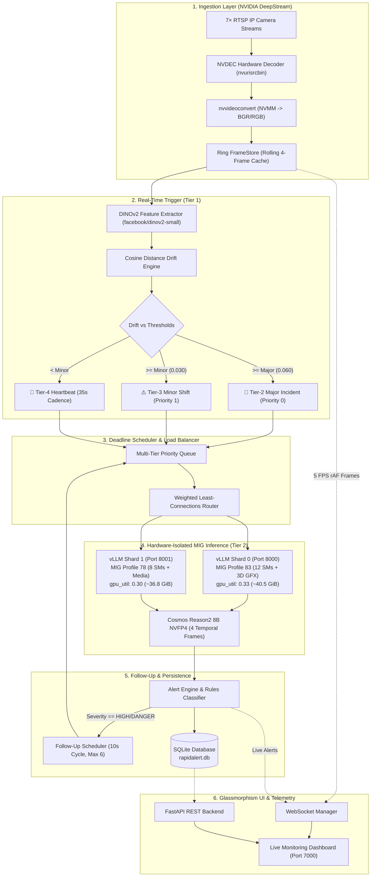
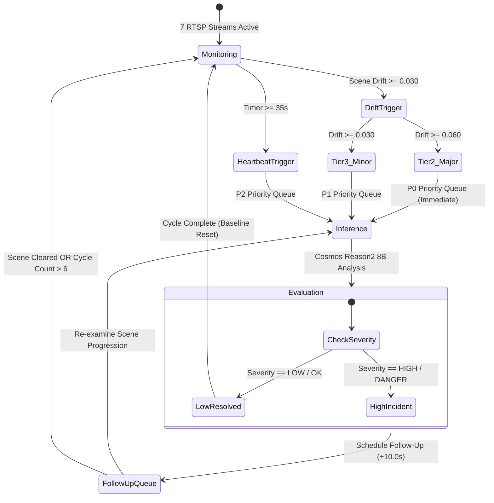

# ⚡ RapidAlert: Hybrid VLM Edge Surveillance Engine
### Autonomous Multi-Camera Reasoning & Dual-Tier Scene Shift Intelligence on NVIDIA Jetson AGX Thor

[](https://www.nvidia.com)
[-blueviolet)](https://huggingface.co/vrfai/Cosmos-Reason2-8B-NVFP4)
[-06B6D4)](#-tier-1-real-time-scene-trigger-dinov2)
[](#-nvidia-thor-mig-partitioning-architecture)
[-green)](https://github.com/vllm-project/vllm)

RapidAlert is an enterprise-grade, edge-native surveillance platform engineered specifically for **NVIDIA Jetson AGX Thor**. It bridges real-time GStreamer/NVDEC camera ingestion and microsecond visual embedding drift detection with deep multimodal reasoning from **Cosmos Reason2 8B (NVFP4)** across partitioned **Multi-Instance GPU (MIG)** compute shards.

---

## 📑 Table of Contents

1. [Architectural Overview](#-architectural-overview)
2. [Dual-Tier Visual Intelligence Pipeline](#-dual-tier-visual-intelligence-pipeline)
   - [Tier 1: Real-Time Scene Trigger (DINOv2)](#tier-1-real-time-scene-trigger-dinov2)
   - [Tier 2: Temporal Multi-Frame Reasoning (Cosmos Reason2 8B)](#tier-2-temporal-multi-frame-reasoning-cosmos-reason2-8b)
3. [NVIDIA Thor Hardware & Memory Architecture](#-nvidia-thor-hardware--memory-architecture)
   - [Unified Memory Dynamics](#unified-memory-dynamics)
   - [RAM Budgeting & KV Cache Sizing](#ram-budgeting--kv-cache-sizing)
4. [NVIDIA Thor MIG Partitioning Deepdive](#-nvidia-thor-mig-partitioning-deepdive)
   - [Hardware Slices (Profile 83 + Profile 78)](#hardware-slices-profile-83--profile-78)
   - [Container Device Interface (CDI) & Device Capabilities](#container-device-interface-cdi--device-capabilities)
5. [Autonomous Scheduler & Follow-Up Lifecycle](#-autonomous-scheduler--follow-up-lifecycle)
6. [Fault Tolerance, Watchdog & Diagnostics](#-fault-tolerance-watchdog--diagnostics)
   - [Automated Pre-Flight Auditor](#automated-pre-flight-auditor)
   - [Continuous Runtime Health Watchdog](#continuous-runtime-health-watchdog)
   - [Structured Error Tracking & Lifecycle Logging](#structured-error-tracking--lifecycle-logging)
7. [Frontend Architecture & Telemetry Dashboard](#-frontend-architecture--telemetry-dashboard)
8. [Configuration Reference](#-configuration-reference)
9. [Deployment & Operations Guide](#-deployment--operations-guide)

---

## 🏗️ Architectural Overview



---

## 🧠 Dual-Tier Visual Intelligence Pipeline

### Tier 1: Real-Time Scene Trigger (DINOv2)
* **Model**: `facebook/dinov2-small` (384-dimensional embeddings, PyTorch with FP16).
* **Latency**: **~8–12 ms** per frame.
* **Mechanism**:
  1. Computes dense spatial token embeddings for every live frame.
  2. Compares the current embedding $E_t$ against a moving baseline $E_{\text{baseline}}$ using Cosine Drift:
     $$\text{Drift} = 1 - \frac{E_t \cdot E_{\text{baseline}}}{\|E_t\|_2 \|E_{\text{baseline}}\|_2}$$
  3. **Dual Drift Classification**:
     * **Major Incident (Tier-2, Priority 0)**: $\text{Drift} \ge \text{dino\_major\_threshold}$ (Default: `0.060`). Triggers immediate emergency reasoning.
     * **Minor Shift (Tier-3, Priority 1)**: $\text{Drift} \ge \text{dino\_minor\_threshold}$ (Default: `0.030`). Catches gradual movements, lighting transitions, or perimeter intrusion.
     * **Heartbeat (Tier-4, Priority 2)**: Triggers periodic baseline audits every 35 seconds.

### Tier 2: Temporal Multi-Frame Reasoning (Cosmos Reason2 8B)
* **Model**: `vrfai/Cosmos-Reason2-8B-NVFP4` running under **vLLM 0.19.0**.
* **Quantization**: NVFP4 (NVIDIA 4-bit floating point hardware weights with standard FP8/BF16 activations).
* **Temporal Sequence**:
  RapidAlert captures **4 consecutive temporal frames** ($t-3, t-2, t-1, t-0$) with interleaved frame markers:
  ```text
  [FRAME 1: t-3] <image>
  [FRAME 2: t-2] <image>
  [FRAME 3: t-1] <image>
  [FRAME 4: t-0 (CURRENT TRIGGER)] <image>

  Analyze the temporal progression across these 4 surveillance frames. Identify what initiated the scene shift, who is involved, and classify safety hazards.
  ```
* **Structured Output Schema**:
  ```json
  {
    "observation": "Worker in blue overalls tripped near open electrical panel at t-1.",
    "severity": "HIGH",
    "safety": "DANGER",
    "workers": 2,
    "machinery": "Open High-Voltage Distribution Board",
    "activity": "Fall Hazard / Electrical Exposure"
  }
  ```

---

## 💾 NVIDIA Thor Hardware & Memory Architecture

### Unified Memory Dynamics
NVIDIA Jetson AGX Thor utilizes a **Unified LPDDR5X Memory Architecture** (128 GB total physical RAM). Unlike discrete PCIe GPUs where VRAM and Host RAM are physically isolated:
* **CPU and GPU share the same 128 GB memory bus**.
* CUDA allocations (weights, activations, PagedAttention KV-caches, NVDEC frame pools) directly consume system memory.
* The Linux kernel page cache (`Inactive(anon)`, `KReclaimable`) caches model files and frame buffers dynamically.

### RAM Budgeting & KV Cache Sizing
To prevent Out-Of-Memory (`OOM-killer`) kernel panics while maximizing parallel inference throughput, memory is balanced proportionally across the hardware partitions:

| Component | Physical RAM Allocated | Configuration Parameter | Purpose |
| :--- | :--- | :--- | :--- |
| **vLLM Shard 0** (Port 8000) | **~40.5 GiB** | `"gpu_utilization": 0.33` | Model weights (7.35 GiB) + 33.15 GiB KV cache on 12-SM shard |
| **vLLM Shard 1** (Port 8001) | **~36.8 GiB** | `"gpu_utilization": 0.30` | Model weights (7.35 GiB) + 29.45 GiB KV cache on 8-SM shard |
| **RapidAlert Backend** | **~21.0 GiB** | Internal | DINOv2 PyTorch model + 7× DeepStream 4K frame ring buffers |
| **OS, Xorg & Desktop GUI** | **~8.0 GiB** | System | GNOME Shell, Xorg, Display server, background daemons |
| **Uncommitted Headroom** | **~16.5 GiB** | Free Memory | Safety buffer for burst concurrency and memory spikes |
| **Total System Memory** | **122.8 GiB (128 GB)** | — | **100% stable, zero OOM risk** |

---

## ⚡ NVIDIA Thor MIG Partitioning Deepdive

### Hardware Slices (Profile 83 + Profile 78)
NVIDIA Thor possesses **20 Streaming Multiprocessors (SMs)** in hardware. JetPack 7.2 partitions this silicon into two isolated physical slices:

```
┌─────────────────────────────────────────────────────────────────────────────┐
│                       NVIDIA AGX THOR SILICON (20 SMs)                      │
├──────────────────────────────────────────────┬──────────────────────────────┤
│       Profile 83: MIG 2g.0gb+gfx (12 SMs)    │ Profile 78: MIG 1g.0gb+me (8 SMs) │
├──────────────────────────────────────────────┼──────────────────────────────┤
│ • 12 CUDA Streaming Multiprocessors         │ • 6 Active CUDA Compute SMs  │
│ • 3D Graphics & Vulkan/OpenGL Engine         │ • 2 Hardware Media Controllers│
│ • Display Engine / Xorg / Desktop Attached   │ • 1× NVDEC (Hardware 4K Dec) │
│ • vLLM Instance 0 (Port 8000)                │ • 1× NVENC (Hardware 4K Enc) │
│ • RapidAlert Backend (DINOv2 + NVMM)        │ • 1× OFA (Optical Flow Accel)│
│                                              │ • 1× JPEG Hardware Decoder   │
│                                              │ • vLLM Instance 1 (Port 8001)│
└──────────────────────────────────────────────┴──────────────────────────────┘
```

### Container Device Interface (CDI) & Device Capabilities
On Jetson Linux in CDI CSV mode, passing raw MIG UUIDs (`NVIDIA_VISIBLE_DEVICES=MIG-...`) causes OCI shim failures. RapidAlert resolves this by dynamically mapping capability device nodes:
* **Shard 0 (`rapidalert_vllm_0`)**: Maps `/dev/nvidia-caps/nvidia-cap1*` with `CUDA_VISIBLE_DEVICES=0`.
* **Shard 1 (`rapidalert_vllm_1`)**: Maps `/dev/nvidia-caps/nvidia-cap2*` with `CUDA_VISIBLE_DEVICES=0`.

---

## 🔄 Autonomous Scheduler & Follow-Up Lifecycle



---

## 🛡️ Fault Tolerance, Watchdog & Diagnostics

### Automated Pre-Flight Auditor
Executed automatically prior to boot via `scripts/system_health_audit.py --fix`:
1. **Process & Port Audit**: Cleans port `7000`, kills orphaned `uvicorn` instances, and reaps zombie processes.
2. **Schema Integrity**: Validates `config/system.json`, `config/cameras.json`, and `config/prompts.json`.
3. **Hardware Acceleration**: Confirms GStreamer NVDEC plugins (`nvurisrcbin`, `nvvideoconvert`) and CUDA device bindings.

### Continuous Runtime Health Watchdog
Runs as a non-blocking background daemon (`SystemWatchdog` in `backend/services/watchdog.py`) every 15 seconds:
* **Stale Stream Recovery**: Detects any camera feed exceeding `15.0s` without new frames and recycles the GStreamer pipeline automatically.
* **Defunct Process Reaper**: Reaps terminated child processes via non-blocking `os.waitpid(-1, os.WNOHANG)`.
* **vLLM Health Probing**: Periodically verifies HTTP `/health` endpoints and marks unresponsive shards offline.

### Structured Error Tracking & Lifecycle Logging
* **Central Error Engine** (`backend/core/error_tracker.py`): Structured capture of exception type, exact line number, affected camera, and downstream operational effects. Persists to SQLite (`data/rapidalert.db`) and [`logs/errors.log`](file:///home/clove/RapidAlert/logs/errors.log).
* **Lifecycle Shutdown Logger** (`backend/core/shutdown_logger.py`): Logs process starts, graceful terminations (`SIGINT`/`Ctrl+C`), and crash diagnostics to [`logs/system_events.log`](file:///home/clove/RapidAlert/logs/system_events.log).

---

## 🖥️ Frontend Architecture & Telemetry Dashboard

The dashboard provides a zero-dependency, ultra-responsive Vanilla JS/CSS monitoring interface:

* **Live Video Grid**: Sub-millisecond snapshot synchronization rendering at 5 FPS using `requestAnimationFrame` to maintain `< 5%` browser CPU load.
* **Centralized Click Delegation**: Clicking any stream card or event thumbnail opens the **Camera Theater Modal** for live RTSP feeds and historical incident inspection.
* **Live Telemetry HUD**: Monitors Jetson AGX Thor hardware metrics (GPU utilization, CPU load, EMC memory clock, and RAM usage).
* **Hot-Reloadable Settings**: Dynamically updates normal context prompts, heartbeat intervals, and drift thresholds without restarting the backend.

---

## ⚙️ Configuration Reference

### `config/system.json`
```json
{
  "vllm_endpoints": [
    {
      "url": "http://localhost:8000",
      "model": "vrfai/Cosmos-Reason2-8B-NVFP4",
      "mig_uuid": "MIG-d08f9290-5142-5a7f-a01a-b5863912a3fa",
      "mig_profile": "2g",
      "sm_count": 12,
      "weight": 3,
      "max_concurrent": 4,
      "queue_depth": 12,
      "gpu_utilization": 0.33
    },
    {
      "url": "http://localhost:8001",
      "model": "vrfai/Cosmos-Reason2-8B-NVFP4",
      "mig_uuid": "MIG-dc038e02-d9bc-54a6-9de6-452fa2b5830f",
      "mig_profile": "1g",
      "sm_count": 8,
      "weight": 2,
      "max_concurrent": 4,
      "queue_depth": 12,
      "gpu_utilization": 0.30
    }
  ],
  "auto_start_vllm": true,
  "vllm_model": "vrfai/Cosmos-Reason2-8B-NVFP4",
  "vllm_port_start": 8000,
  "vllm_max_seqs": 4,
  "vllm_max_model_len": 4096,
  "vllm_gpu_utilization": 0.33,
  "vllm_instances": 2,
  "ingest_backend": "nvidia",
  "trigger_backend": "dinov2",
  "dinov2_model": "facebook/dinov2-small",
  "dino_major_threshold": 0.060,
  "dino_minor_threshold": 0.030,
  "default_heartbeat_sec": 35.0,
  "followup_interval_sec": 10.0,
  "persistent_followup": true,
  "followup_max_cycles": 6
}
```

---

## 🚀 Deployment & Operations Guide

### Quick Start
```bash
# 1. Clone repository
git clone https://github.com/kaushikvarma-create/RapidAlert.git
cd RapidAlert

# 2. Start Full System (Audits system, boots vLLM containers, launches backend)
### Automatic Startup Configuration (Boot & Login)
To configure RapidAlert to start automatically on system boot or user login:
```bash
# Install and enable background systemd service + desktop autostart:
sudo ./scripts/setup_autostart.sh

# Manage the background service:
sudo systemctl status rapidalert    # Check live status
sudo systemctl start rapidalert     # Start service
sudo systemctl stop rapidalert      # Stop service
sudo journalctl -u rapidalert -f    # Follow service logs

# To disable autostart:
./scripts/setup_autostart.sh --disable
```

### Accessing Interfaces
* **Web Dashboard**: `http://localhost:7000` (auto-opens in browser on start)
* **Swagger API Documentation**: `http://localhost:7000/docs`
* **vLLM Shard 0 OpenAPI**: `http://localhost:8000/docs`
* **vLLM Shard 1 OpenAPI**: `http://localhost:8001/docs`

### Useful Diagnostic Commands
```bash
# Check running containers
docker stats --no-stream

# View real-time system logs
tail -f logs/app.log

# View structured lifecycle & shutdown events
tail -f logs/system_events.log

# Inspect structured exceptions
tail -f logs/errors.log

# Run manual pre-flight system audit
python3 scripts/system_health_audit.py --fix
```
