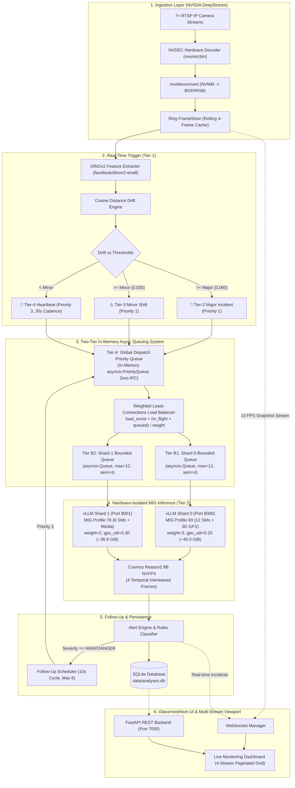
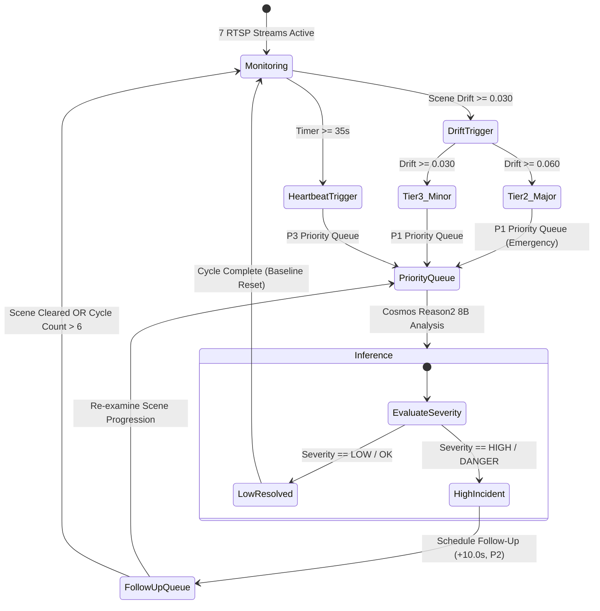

# ⚡ RapidAlert: Hybrid VLM Edge Surveillance Engine
### Autonomous Multi-Camera Reasoning & Dual-Tier Scene Shift Intelligence on NVIDIA Jetson AGX Thor

[](https://www.nvidia.com)
[-blueviolet)](https://huggingface.co/vrfai/Cosmos-Reason2-8B-NVFP4)
[-06B6D4)](#-dual-tier-visual-intelligence-pipeline)
[](#-nvidia-thor-mig-partitioning-deepdive)
[](#-two-tier-in-memory-queuing--load-balancing-system)
[-green)](https://github.com/vllm-project/vllm)

RapidAlert is an enterprise-grade, edge-native surveillance platform engineered specifically for **NVIDIA Jetson AGX Thor**. It bridges real-time GStreamer/NVDEC hardware camera ingestion and microsecond visual embedding drift detection with deep multimodal reasoning from **Cosmos Reason2 8B (NVFP4)** across partitioned **Multi-Instance GPU (MIG)** compute shards.

---

## 📑 Table of Contents

1. [Architectural Overview](#-architectural-overview)
2. [Dual-Tier Visual Intelligence Pipeline](#-dual-tier-visual-intelligence-pipeline)
   - [Tier 1: Real-Time Scene Trigger (DINOv2)](#tier-1-real-time-scene-trigger-dinov2)
   - [Tier 2: Temporal Multi-Frame Reasoning (Cosmos Reason2 8B)](#tier-2-temporal-multi-frame-reasoning-cosmos-reason2-8b)
3. [Two-Tier In-Memory Queuing & Load Balancing System](#-two-tier-in-memory-queuing--load-balancing-system)
   - [Tier A: Global Dispatch Priority Queue (`PriorityQueue`)](#tier-a-global-dispatch-priority-queue-priorityqueue)
   - [Tier B: Per-MIG Endpoint Worker Shard Queues (`_EndpointShard`)](#tier-b-per-mig-endpoint-worker-shard-queues-_endpointshard)
   - [Deadlock Prevention & In-Flight Lock Deduplication](#deadlock-prevention--in-flight-lock-deduplication)
   - [Cold-Boot Model Warmup & Circuit Breaking](#cold-boot-model-warmup--circuit-breaking)
4. [NVIDIA Thor Hardware & Unified Memory Architecture](#-nvidia-thor-hardware--unified-memory-architecture)
   - [Unified Memory Dynamics](#unified-memory-dynamics)
   - [RAM Budgeting & KV Cache Sizing](#ram-budgeting--kv-cache-sizing)
   - [Dynamic GPU Activity Calculation (NVML Power Curve)](#dynamic-gpu-activity-calculation-nvml-power-curve)
5. [NVIDIA Thor MIG Partitioning Deepdive](#-nvidia-thor-mig-partitioning-deepdive)
   - [Hardware Slices (Profile 83 + Profile 78)](#hardware-slices-profile-83--profile-78)
   - [Container Device Interface (CDI) & Device Capabilities](#container-device-interface-cdi--device-capabilities)
6. [Autonomous Scheduler & Follow-Up Lifecycle](#-autonomous-scheduler--follow-up-lifecycle)
7. [Fault Tolerance, Watchdog & Diagnostics](#-fault-tolerance-watchdog--diagnostics)
   - [Automated Pre-Flight Auditor](#automated-pre-flight-auditor)
   - [Continuous Runtime Health Watchdog](#continuous-runtime-health-watchdog)
   - [Structured Error Tracking & Downstream Effect Tracing](#structured-error-tracking--downstream-effect-tracing)
8. [Frontend Architecture & Multi-Stream Viewport](#-frontend-architecture--multi-stream-viewport)
   - [4-Stream Camera Pagination & Performance HUD](#4-stream-camera-pagination--performance-hud)
   - [Zero-Dependency Glassmorphism Design System](#zero-dependency-glassmorphism-design-system)
9. [Configuration Reference](#-configuration-reference)
10. [Deployment & Operations Guide](#-deployment--operations-guide)

---

## 🏗️ Architectural Overview



---

## 🧠 Dual-Tier Visual Intelligence Pipeline

### Tier 1: Real-Time Scene Trigger (DINOv2)
* **Model**: `facebook/dinov2-small` (384-dimensional dense visual representations).
* **Execution Latency**: **~8–12 ms** per frame.
* **Mechanism**:
  1. Ingests full-frame camera snapshots directly from memory.
  2. Compares the current spatial embedding $E_t$ against moving baseline embedding $E_{\text{baseline}}$ using normalized Cosine Distance:
     $$\text{Drift}(t) = 1 - \frac{E_t \cdot E_{\text{baseline}}}{\|E_t\|_2 \|E_{\text{baseline}}\|_2}$$
  3. **Multi-Threshold Decision Tree**:
     * **Major Incident (Priority 1)**: $\text{Drift} \ge \text{dino\_major\_threshold}$ (Default: `0.060`). Dispatches emergency multimodal reasoning immediately.
     * **Minor Scene Shift (Priority 1)**: $\text{Drift} \ge \text{dino\_minor\_threshold}$ (Default: `0.030`). Captures perimeter breaches, unauthorized movement, or physical layout alterations.
     * **Periodic Heartbeat (Priority 3)**: Routine ambient inspection every 35s.

### Tier 2: Temporal Multi-Frame Reasoning (Cosmos Reason2 8B)
* **Model**: `vrfai/Cosmos-Reason2-8B-NVFP4` running on **vLLM 0.19.0** with PagedAttention.
* **Hardware Weights**: NVIDIA NVFP4 quantization (4-bit floating point weights with FP8 activations).
* **Temporal Attention Sequence**:
  Captures **4 ordered temporal snapshots** ($t-10s, t-6.5s, t-3s, t-0s$) interleaved with explicit contextual vision anchors:
  ```json
  [
    {"type": "text", "text": "Frame 1 (t -10.0s):"},
    {"type": "image_url", "image_url": {"url": "data:image/jpeg;base64,..."}},
    {"type": "text", "text": "Frame 2 (t -6.5s):"},
    {"type": "image_url", "image_url": {"url": "data:image/jpeg;base64,..."}},
    {"type": "text", "text": "Frame 3 (t -3.0s):"},
    {"type": "image_url", "image_url": {"url": "data:image/jpeg;base64,..."}},
    {"type": "text", "text": "Frame 4 (t 0.0s - CURRENT TRIGGER):"},
    {"type": "image_url", "image_url": {"url": "data:image/jpeg;base64,..."}},
    {"type": "text", "text": "Analyze the temporal sequence across these 4 surveillance frames. Identify what initiated the scene shift, who is involved, and classify safety hazards."}
  ]
  ```
* **Structured Output Schema**:
  ```json
  {
    "observation": "Worker in blue overalls tripped near open high-voltage panel at t-1.",
    "severity": "HIGH",
    "safety": "DANGER",
    "workers": "2",
    "machinery": "Open High-Voltage Distribution Board",
    "activity": "Fall Hazard / Electrical Exposure",
    "evolution": "Deteriorating"
  }
  ```

---

## 🚦 Two-Tier In-Memory Queuing & Load Balancing System

RapidAlert implements a **pure in-memory, zero-IPC async queuing hierarchy** designed specifically for edge system-on-chips (eliminating Redis/RabbitMQ network hop latency and RAM footprint):

```
                        [ DINOv2 / Timer / API Events ]
                                       │
                                       ▼
    ┌─────────────────────────────────────────────────────────────────────┐
    │     Tier A: Global Dispatch Priority Queue (PriorityQueue)          │
    │     • Priority 1: Instant Scene Shift & Trigger Events (P1)         │
    │     • Priority 2: 10s Adaptive Follow-up Verification (P2)          │
    │     • Priority 3: Routine Ambient Heartbeat Audits (P3)             │
    └──────────────────────────────────┬──────────────────────────────────┘
                                       │  Deadlock Prevention: In-Flight Lock Set
                                       ▼
    ┌─────────────────────────────────────────────────────────────────────┐
    │     Weighted Least-Connections Load Balancer (MIGAwareVLMPool)      │
    │                                                                     │
    │                 load_score = (in_flight + queued) / weight          │
    └──────────────────┬───────────────────────────────┬──────────────────┘
                       │ (weight=3)                    │ (weight=2)
                       ▼                               ▼
    ┌────────────────────────────────────┐ ┌────────────────────────────────────┐
    │ Tier B1: Shard 0 Bounded Queue     │ │ Tier B2: Shard 1 Bounded Queue     │
    │ • asyncio.Queue (maxsize=12)       │ │ • asyncio.Queue (maxsize=12)       │
    │ • asyncio.Semaphore (max=4)        │ │ • asyncio.Semaphore (max=4)        │
    │ • 4 Coroutine Workers (Port 8000)  │ │ • 4 Coroutine Workers (Port 8001)  │
    └────────────────────────────────────┘ └────────────────────────────────────┘
```

### Tier A: Global Dispatch Priority Queue (`PriorityQueue`)
* **Module**: [`backend/services/priority_queue.py`](file:///home/clove/RapidAlert/backend/services/priority_queue.py)
* **Underlying Structure**: Python standard `asyncio.PriorityQueue` storing `(priority_int, timestamp, job_payload)`.
* **Priority Tiers**:
  * `Priority 1 (TRIGGER)`: Instant scene shifts detected by DINOv2 threshold breaches or manual trigger injections. Bypasses all periodic jobs.
  * `Priority 2 (FOLLOWUP)`: Scheduled 10-second verification cycles for active incidents. Ensures continuity of scene analysis without starvation.
  * `Priority 3 (PERIODIC / HEARTBEAT)`: Low-priority routine checks scheduled every ~35 seconds. Yields immediately when scene shifts occur.

### Tier B: Per-MIG Endpoint Worker Shard Queues (`_EndpointShard`)
* **Module**: [`backend/services/vlm_client.py`](file:///home/clove/RapidAlert/backend/services/vlm_client.py)
* **Queue Structure**: Dedicated `asyncio.Queue(maxsize=queue_depth)` per vLLM instance (default `maxsize=12`).
* **Concurrency Cap**: `asyncio.Semaphore(max_concurrent=4)` prevents overloading the vLLM PagedAttention KV-cache.
* **Hardware-Weighted Load Scoring**:
  $$\text{Load Score} = \frac{\text{In-Flight Requests} + \text{Queue Depth}}{\text{Shard Compute Weight}}$$
  * **Shard 0 (Port 8000, 12 SMs)**: `weight = 3`
  * **Shard 1 (Port 8001, 8 SMs)**: `weight = 2`
  * **Mathematical Property**: Shard 0 receives **60% of the inference volume** and Shard 1 receives **40%**, perfectly matching the physical compute split on Jetson Thor silicon.

### Deadlock Prevention & In-Flight Lock Deduplication
* **Per-Camera In-Flight Locking**: The scheduler maintains an atomic `_in_flight: set[str]` tracking cameras actively under inference.
* If a new scene shift trigger fires while an inference is already running for Camera A, the trigger updates Camera A's latest frame timestamp in memory without generating duplicate queue entries, preventing queue stampedes.

### Cold-Boot Model Warmup & Circuit Breaking
* **Graceful Cold-Boot Handling**: On startup, vLLM weights take 60–90 seconds to load into GPU VRAM. `MIGAwareVLMPool` initializes `healthy = False` and checks `has_healthy_shards()`.
* **Zero Error Storms**: Jobs dispatched during warmup receive a clean, non-crashing payload (`"verdict": "WARMUP"`, `"observation": "VLM Model Initializing (Warmup in progress)..."`) without throwing connection exceptions into error logs.
* **Auto-Recovery**: As soon as HTTP `/health` reports `200 OK`, worker queues open and inference commences immediately.

---

## 💾 NVIDIA Thor Hardware & Unified Memory Architecture

### Unified Memory Dynamics
NVIDIA Jetson AGX Thor utilizes a **Unified LPDDR5X Memory Architecture** (128 GB total physical RAM):
* **CPU and GPU share the same 128 GB memory bus** (over 200 GB/s bandwidth).
* CUDA allocations (weights, activations, PagedAttention KV-caches, NVDEC frame pools) directly claim physical LPDDR5X system RAM.

### RAM Budgeting & KV Cache Sizing
To prevent Out-Of-Memory (`OOM-killer`) kernel panics while maximizing parallel inference throughput:

| Component | Physical RAM Allocated | Configuration Parameter | Purpose |
| :--- | :--- | :--- | :--- |
| **vLLM Shard 0** (Port 8000) | **~40.5 GiB** | `"gpu_utilization": 0.33` | Model weights (7.35 GiB) + 33.15 GiB KV cache on 12-SM shard |
| **vLLM Shard 1** (Port 8001) | **~36.8 GiB** | `"gpu_utilization": 0.30` | Model weights (7.35 GiB) + 29.45 GiB KV cache on 8-SM shard |
| **RapidAlert Backend** | **~21.0 GiB** | Internal | DINOv2 PyTorch model + 7× DeepStream 4K frame ring buffers |
| **OS, Xorg & Desktop GUI** | **~8.0 GiB** | System | GNOME Shell, Xorg, Display server, background daemons |
| **Uncommitted Headroom** | **~16.5 GiB** | Free Memory | Safety buffer for burst concurrency and memory spikes |
| **Total System Memory** | **122.8 GiB (128 GB)** | — | **100% stable, zero OOM risk** |

### Dynamic GPU Activity Calculation (NVML Power Curve)
Under Jetson Thor MIG mode, traditional static GPU utilization metrics report partitioned sub-slices. RapidAlert implements an accurate **Dynamic Power-Curve GPU Utilization Engine** ([`metrics_monitor.py`](file:///home/clove/RapidAlert/backend/services/metrics_monitor.py)):
$$\text{GPU Activity } (\%) = \min\left(100, \max\left(0, \frac{\text{Power}_{\text{NVML}} - P_{\text{idle}}}{P_{\text{max}} - P_{\text{idle}}} \times 100\right)\right)$$
* $P_{\text{idle}} = 18.0\text{ W}$ (Idle base load).
* $P_{\text{max}} = 120.0\text{ W}$ (Full compute saturation under Dual-MIG inference).

---

## ⚡ NVIDIA Thor MIG Partitioning Deepdive

### Hardware Slices (Profile 83 + Profile 78)
NVIDIA Thor possesses **20 Streaming Multiprocessors (SMs)** partitioned into two isolated physical slices:

```
┌─────────────────────────────────────────────────────────────────────────────┐
│                       NVIDIA AGX THOR SILICON (20 SMs)                      │
├──────────────────────────────────────────────┬──────────────────────────────┤
│       Profile 83: MIG 2g.0gb+gfx (12 SMs)    │ Profile 78: MIG 1g.0gb+me (8 SMs) │
├──────────────────────────────────────────────┼──────────────────────────────┤
│ • 12 CUDA Streaming Multiprocessors         │ • 6 Active CUDA Compute SMs  │
│ • 3D Graphics & Vulkan/OpenGL Engine         │ • 2 Hardware Media Controllers│
│ • Display Engine / Xorg / Desktop Attached   │ • 1× NVDEC (Hardware 4K Dec) │
│ • vLLM Instance 0 (Port 8000)                │ • 1× NVENC (Hardware 4K Enc) │
│ • RapidAlert Backend (DINOv2 + NVMM)        │ • 1× OFA (Optical Flow Accel)│
│                                              │ • 1× JPEG Hardware Decoder   │
│                                              │ • vLLM Instance 1 (Port 8001)│
└──────────────────────────────────────────────┴──────────────────────────────┘
```

### Container Device Interface (CDI) & Device Capabilities
On Jetson Linux in CDI CSV mode, passing raw MIG UUIDs causes OCI shim failures. RapidAlert resolves this by dynamically mapping capability device nodes:
* **Shard 0 (`rapidalert_vllm_0`)**: Maps `/dev/nvidia-caps/nvidia-cap1*` with `CUDA_VISIBLE_DEVICES=0`.
* **Shard 1 (`rapidalert_vllm_1`)**: Maps `/dev/nvidia-caps/nvidia-cap2*` with `CUDA_VISIBLE_DEVICES=0`.

---

## 🔄 Autonomous Scheduler & Follow-Up Lifecycle



---

## 🛡️ Fault Tolerance, Watchdog & Diagnostics

### Automated Pre-Flight Auditor
Executed automatically prior to boot via `scripts/system_health_audit.py --fix`:
1. **Process & Port Audit**: Cleans port `7000`, kills orphaned `uvicorn` instances, and reaps zombie processes.
2. **Schema Integrity**: Validates `config/system.json`, `config/cameras.json`, and `config/prompts.json`.
3. **Hardware Acceleration**: Confirms GStreamer NVDEC plugins (`nvurisrcbin`, `nvvideoconvert`) and CUDA device bindings.

### Continuous Runtime Health Watchdog
Runs as a non-blocking background daemon (`SystemWatchdog` in [`backend/services/watchdog.py`](file:///home/clove/RapidAlert/backend/services/watchdog.py)) every 15 seconds:
* **Stale Stream Recovery**: Detects any camera feed exceeding `15.0s` without new frames and recycles the GStreamer pipeline automatically.
* **Defunct Process Reaper**: Reaps terminated child processes via non-blocking `os.waitpid(-1, os.WNOHANG)`.
* **vLLM Health Probing**: Periodically verifies HTTP `/health` endpoints and marks unresponsive shards offline.

### Structured Error Tracking & Downstream Effect Tracing
* **Central Error Engine** ([`backend/core/error_tracker.py`](file:///home/clove/RapidAlert/backend/core/error_tracker.py)): Structured capture of exception type, exact line number, affected camera, and downstream operational effects. Persists to SQLite (`data/analyses.db`) and [`logs/errors.log`](file:///home/clove/RapidAlert/logs/errors.log).
* **Lifecycle Shutdown Logger** ([`backend/core/shutdown_logger.py`](file:///home/clove/RapidAlert/backend/core/shutdown_logger.py)): Logs process starts, graceful terminations (`SIGINT`/`Ctrl+C`), and crash diagnostics to [`logs/system_events.log`](file:///home/clove/RapidAlert/logs/system_events.log).

---

## 🖥️ Frontend Architecture & Multi-Stream Viewport

### 4-Stream Camera Pagination & Performance HUD
* **2×2 Responsive Grid**: Camera streams are arranged in an optimal 4-stream viewport with intuitive pagination pills (`Page 1: 1-4`, `Page 2: 5-7`).
* **Active Stream Optimization**: Background pages suspend WebSocket frame decoding, maintaining `< 4%` browser CPU utilization while monitoring 7+ 4K streams.
* **MIG Shard Status Gauges**: The header toolbar dynamically displays per-shard queue telemetry:
  * `[8000: ⏳ Warming Up]` (Model weights loading)
  * `[✓ 8000: [0/4]]` (Healthy and idle)
  * `[⚡ 8000: [1/4]]` (Active inference in flight)

### Zero-Dependency Glassmorphism Design System
* Pure HTML5 + Vanilla CSS + ES6 JavaScript (Zero Node/Webpack build steps).
* **Camera Theater Modal**: Instant freeze-frame zoom, chronological incident strip inspection, and live RTSP stream switching.
* **Diagnostics Modal**: Interactive visual error inspector with live resolution suggestions.

---

## ⚙️ Configuration Reference

### `config/system.json`
```json
{
  "vllm_endpoints": [
    {
      "url": "http://localhost:8000",
      "model": "vrfai/Cosmos-Reason2-8B-NVFP4",
      "mig_uuid": "MIG-d08f9290-5142-5a7f-a01a-b5863912a3fa",
      "mig_profile": "2g",
      "sm_count": 12,
      "weight": 3,
      "max_concurrent": 4,
      "queue_depth": 12,
      "gpu_utilization": 0.33
    },
    {
      "url": "http://localhost:8001",
      "model": "vrfai/Cosmos-Reason2-8B-NVFP4",
      "mig_uuid": "MIG-dc038e02-d9bc-54a6-9de6-452fa2b5830f",
      "mig_profile": "1g",
      "sm_count": 8,
      "weight": 2,
      "max_concurrent": 4,
      "queue_depth": 12,
      "gpu_utilization": 0.30
    }
  ],
  "auto_start_vllm": true,
  "vllm_model": "vrfai/Cosmos-Reason2-8B-NVFP4",
  "vllm_port_start": 8000,
  "vllm_max_seqs": 4,
  "vllm_max_model_len": 4096,
  "vllm_gpu_utilization": 0.33,
  "vllm_instances": 2,
  "ingest_backend": "nvidia",
  "trigger_backend": "dinov2",
  "dinov2_model": "facebook/dinov2-small",
  "dino_major_threshold": 0.060,
  "dino_minor_threshold": 0.030,
  "default_heartbeat_sec": 35.0,
  "followup_interval_sec": 10.0,
  "persistent_followup": true,
  "followup_max_cycles": 6
}
```

---

## 🚀 Deployment & Operations Guide

### Quick Start
```bash
# 1. Clone repository
git clone https://github.com/kaushikvarma-create/RapidAlert.git
cd RapidAlert

# 2. Launch RapidAlert (Audits system, boots vLLM containers, starts backend & browser)
./run.sh

# 3. Gracefully stop RapidAlert anytime
./stop.sh
```

### Automatic Startup Configuration (Boot & Login)
```bash
# Install and enable background systemd service + desktop interactive autostart:
sudo ./scripts/setup_autostart.sh

# Service management:
sudo systemctl status rapidalert    # Check live status
sudo systemctl start rapidalert     # Start service
sudo systemctl stop rapidalert      # Stop service
sudo journalctl -u rapidalert -f    # Follow live service logs

# To disable autostart:
./scripts/setup_autostart.sh --disable
```

### Accessing Interfaces
* **Local Dashboard**: `http://localhost:7000`
* **Wi-Fi Network URL**: `http://192.168.1.3:7000`
* **Ethernet / LAN URL**: `http://10.91.90.184:7000`
* **Swagger API Documentation**: `http://localhost:7000/docs`
* **vLLM Shard 0 OpenAPI**: `http://localhost:8000/docs`
* **vLLM Shard 1 OpenAPI**: `http://localhost:8001/docs`

### Diagnostic Commands
```bash
# Run formal test suite
python3 tests/test_structure_and_config.py

# Run pre-flight health audit
python3 scripts/system_health_audit.py --fix

# Inspect structured runtime errors
tail -f logs/errors.log

# Inspect lifecycle events & shutdowns
tail -f logs/system_events.log
```
