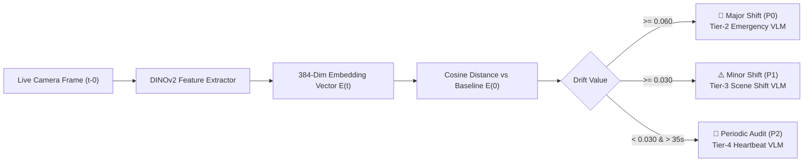
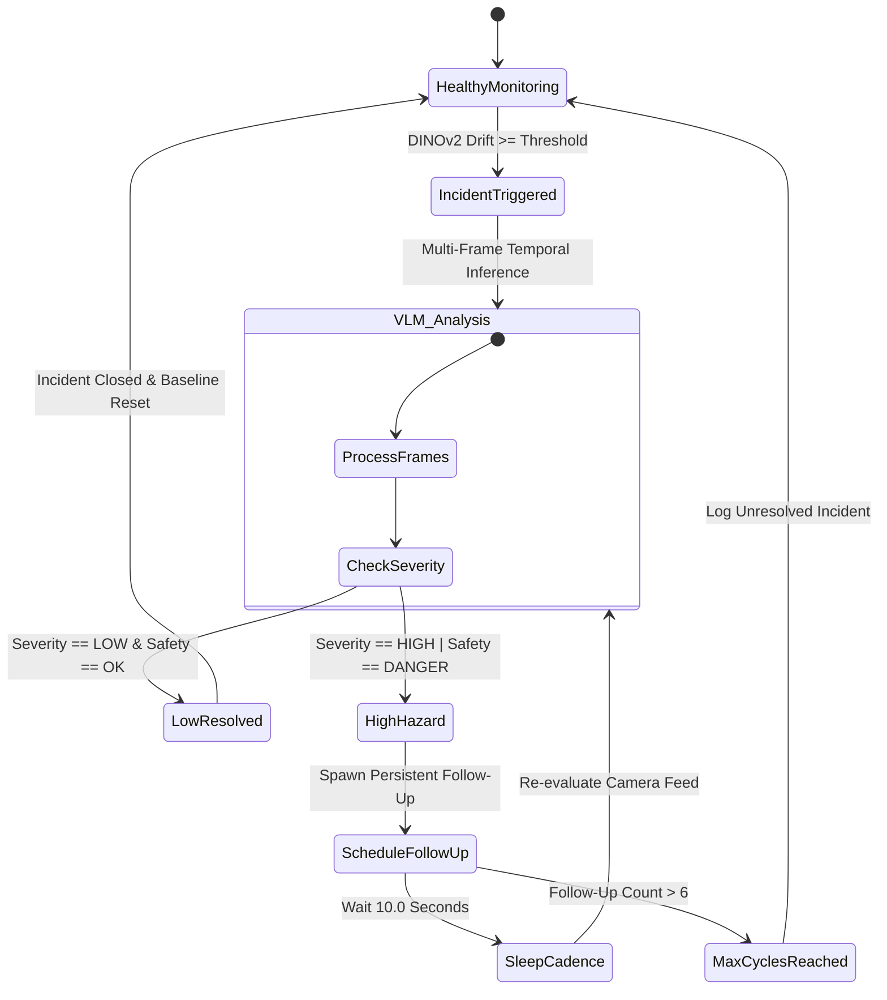

# RapidAlert: Architectural & Technical Deep Dive
### Engineering Reference: Hybrid Edge VLM Surveillance on NVIDIA Jetson AGX Thor

---

## 1. System Philosophy & Executive Summary

Traditional CCTV computer vision relies on narrow object detection (YOLO) or optical flow bounding boxes that lack semantic context, causal reasoning, and temporal understanding. Conversely, cloud-hosted Multimodal Large Language Models (MLLMs) introduce multi-second network latencies, bandwidth saturation from high-resolution multi-camera feeds, and data sovereignty liabilities.

**RapidAlert** resolves this paradigm through an **Edge-Native Hybrid Vision Pipeline**:
1. **Tier 1 (Sub-10ms Fast Path)**: Real-time dense feature extraction via **DINOv2** computes continuous cosine embedding drift on local frames to detect any structural or semantic shift with near-zero compute overhead.
2. **Tier 2 (Deep Reasoning Path)**: When a shift exceeds calibrated thresholds, a multi-tier deadline scheduler captures a **4-frame temporal sequence** ($t-3, t-2, t-1, t-0$) and routes it to **Cosmos Reason2 8B (NVFP4)** running across hardware-isolated **NVIDIA Multi-Instance GPU (MIG)** shards.
3. **Tier 3 (Autonomous Persistence & Follow-Up)**: If a safety hazard or incident is flagged (`HIGH`/`DANGER`), an autonomous follow-up loop re-inspects the scene every 10 seconds until the situation resolves.

---

## 2. Hardware Architecture & Unified Memory Subsystem

### 2.1 NVIDIA Jetson AGX Thor Platform Specifications

* **Compute Capability**: NVIDIA Blackwell Architecture with 4th Gen Tensor Cores & NVFP4 Tensor Accelerators.
* **Streaming Multiprocessors (SMs)**: **20 SMs** in physical silicon.
* **Memory Subsystem**: **128 GB 256-bit LPDDR5X Unified Memory** operating at 4266 MHz (over 200 GB/s memory bandwidth).
* **Hardware Media Accelerators**: NVDEC (Hardware 4K H.264/H.265/AV1 Decoder), NVENC (Hardware Encoder), OFA (Optical Flow Accelerator), JPEG Decoder Engine.

```
┌─────────────────────────────────────────────────────────────────────────────┐
│                       NVIDIA AGX THOR SILICON (20 SMs)                      │
├──────────────────────────────────────────────┬──────────────────────────────┤
│       Profile 83: MIG 2g.0gb+gfx (12 SMs)    │ Profile 78: MIG 1g.0gb+me (8 SMs) │
├──────────────────────────────────────────────┼──────────────────────────────┤
│ • 12 CUDA Streaming Multiprocessors         │ • 6 Active CUDA Compute SMs  │
│ • 3D Graphics & Vulkan/OpenGL Engine         │ • 2 Hardware Media Controllers│
│ • Display Engine / Xorg / Desktop Attached   │ • 1× NVDEC (Hardware 4K Dec) │
│ • vLLM Instance 0 (Port 8000)                │ • 1× NVENC (Hardware 4K Enc) │
│ • RapidAlert Backend (DINOv2 + NVMM)        │ • 1× OFA (Optical Flow Accel)│
│                                              │ • 1× JPEG Hardware Decoder   │
│                                              │ • vLLM Instance 1 (Port 8001)│
└──────────────────────────────────────────────┴──────────────────────────────┘
```

### 2.2 Unified Memory Mechanics & Allocation Topology

On NVIDIA Thor, **Host RAM and GPU VRAM share the same physical silicon address space**. Every CUDA tensor, frame buffer, and PagedAttention KV cache block directly claims physical LPDDR5X system RAM.

#### Memory Sizing Formula in vLLM:
The physical memory claimed by each vLLM instance on startup is governed by:
$$\text{Memory}_{\text{vLLM}} = \text{Weights}_{\text{NVFP4}} + \left( \text{RAM}_{\text{total}} \times \text{gpu\_memory\_utilization} \right)$$

Where:
* $\text{Weights}_{\text{NVFP4}} \approx 7.35\text{ GiB}$ for `vrfai/Cosmos-Reason2-8B-NVFP4`.
* $\text{RAM}_{\text{total}} = 122.8\text{ GiB}$ (Usable LPDDR5X capacity).

#### Production Memory Budget:
```
Total Unified Physical Memory: 122.8 GiB (128 GB)
├── vLLM Instance 0 (Port 8000, 12 SMs) ── 0.33 util ── 40.5 GiB (7.35 GB Weights + 33.15 GB KV Cache)
├── vLLM Instance 1 (Port 8001,  8 SMs) ── 0.30 util ── 36.8 GiB (7.35 GB Weights + 29.45 GB KV Cache)
├── RapidAlert Backend (uvicorn / DINOv2) ────────────── 21.0 GiB (Embedding Model + 7× NVMM Frame Buffers)
├── Desktop, GNOME Shell, Xorg & IDE ──────────────────── 8.0 GiB (Display Server & Dev Tools)
└── Uncommitted Safety Headroom ───────────────────────── 16.5 GiB (Burst Concurrency & Zero-OOM Buffer)
```

---

## 3. Multi-Instance GPU (MIG) & Container Virtualization

### 3.1 Partition Profiles on JetPack 7.2

Under JetPack 7.2 for Jetson AGX Thor, hardware partitioning is established prior to display manager initialization via `/usr/local/bin/create-thor-mig.sh`:

1. **Slice 0 (Profile 83 / `2g.0gb+gfx`)**:
   * **12 Streaming Multiprocessors (SMs)**.
   * Graphics-enabled: Binds Xorg, GNOME Shell, and Desktop UI rendering alongside `vllm_0` (Port 8000).
2. **Slice 1 (Profile 78 / `1g.0gb+me`)**:
   * **8 Physical SMs** (6 general-purpose CUDA Compute SMs + 2 SMs dedicated to NVDEC, NVENC, OFA, and JPEG engines).
   * Houses `vllm_1` (Port 8001) for dedicated video reasoning.

### 3.2 Jetson CDI Capability Mapping Architecture

Standard desktop Docker flags like `NVIDIA_VISIBLE_DEVICES=MIG-...` fail on Jetson's Container Device Interface (CDI) in CSV mode. RapidAlert resolves this by mounting the specific **MIG Capability Nodes** directly into the container namespace:

```bash
# Instance 0 (GI 1): Maps cap1, cap12, cap13
docker run -d \
    --name "rapidalert_vllm_0" \
    --runtime nvidia \
    --network host \
    --shm-size=4g \
    -e NVIDIA_VISIBLE_DEVICES=all \
    -e CUDA_VISIBLE_DEVICES=0 \
    --device /dev/nvidia-caps/nvidia-cap1 \
    --device /dev/nvidia-caps/nvidia-cap12 \
    --device /dev/nvidia-caps/nvidia-cap13 \
    ghcr.io/nvidia-ai-iot/vllm:latest-jetson-thor \
    vllm serve "vrfai/Cosmos-Reason2-8B-NVFP4" --port 8000 --gpu-memory-utilization 0.33 ...

# Instance 1 (GI 2): Maps cap2, cap21, cap22
docker run -d \
    --name "rapidalert_vllm_1" \
    --runtime nvidia \
    --network host \
    --shm-size=4g \
    -e NVIDIA_VISIBLE_DEVICES=all \
    -e CUDA_VISIBLE_DEVICES=0 \
    --device /dev/nvidia-caps/nvidia-cap2 \
    --device /dev/nvidia-caps/nvidia-cap21 \
    --device /dev/nvidia-caps/nvidia-cap22 \
    ghcr.io/nvidia-ai-iot/vllm:latest-jetson-thor \
    vllm serve "vrfai/Cosmos-Reason2-8B-NVFP4" --port 8001 --gpu-memory-utilization 0.30 ...
```

Inside each container, CUDA initializes exclusively against its isolated hardware slice with zero cross-container memory contention or context thrashing.

---

## 4. Ingestion Pipeline: DeepStream NVDEC & FrameStore

```
┌─────────────────────────────────────────────────────────────────────────────┐
│                    HIGH-THROUGHPUT NVDEC INGESTION PIPELINE                 │
├───────────────┬───────────────────┬───────────────────┬─────────────────────┤
│  RTSP Stream  │ Hardware Decoder  │  Format Transform │ Thread-Safe Storage │
│ (H.264/H.265) │   (nvurisrcbin)   │ (nvvideoconvert)  │  (Ring FrameStore)  │
├───────────────┼───────────────────┼───────────────────┼─────────────────────┤
│ 7 Streams @   │ Zero-Copy NVMM    │ Hardware NVMM to  │ Rolling circular    │
│ 1080p / 4K    │ Hardware Decoder  │ BGR/RGB 768px max │ buffer of 4 frames  │
│ 25-30 FPS     │ 0% CPU footprint  │ with 0-copy DMA   │ with timestamps     │
└───────────────┴───────────────────┴───────────────────┴─────────────────────┘
```

### 4.1 Zero-Staleness Frame Ingestion
In real-time VLM surveillance, inference takes **1.2–2.0 seconds**, while cameras produce frames every **33 ms** (30 FPS). Traditional FIFO queues inevitably back up, causing models to analyze stale history.

RapidAlert implements a **Non-Blocking Ring Buffer (`FrameStore`)**:
* Dedicated ingestion threads poll hardware NVDEC decoders.
* As frames arrive, they overwrite a fixed-capacity ring buffer ($t-3, t-2, t-1, t-0$).
* When an inference trigger fires, the scheduler immediately extracts the exact $4$-frame temporal history without queuing delay.

---

## 5. Dual-Tier Scene Shift Intelligence



### 5.1 Cosine Distance Metric
$$\mathcal{D}_{\text{drift}}(E_t, E_{\text{baseline}}) = 1 - \frac{\sum_{i=1}^{384} E_{t,i} \cdot E_{\text{baseline},i}}{\sqrt{\sum_{i=1}^{384} E_{t,i}^2} \cdot \sqrt{\sum_{i=1}^{384} E_{\text{baseline},i}^2}}$$

### 5.2 Dynamic Drift Adaptation
To handle natural lighting shifts (e.g. dawn, dusk, cloud cover) without triggering false alarms, the baseline embedding is updated via an exponential moving average (EMA) filter:
$$E_{\text{baseline}} \leftarrow (1 - \alpha) E_{\text{baseline}} + \alpha E_t \quad (\alpha = 0.02)$$

When an actual incident occurs ($\mathcal{D}_{\text{drift}} \ge \text{threshold}$), EMA adaptation is temporarily frozen to prevent the anomaly from poisoning the reference baseline.

---

## 6. Multi-Frame Temporal Reasoning Engine

### 6.1 Interleaved Multimodal Token Representation
When a trigger fires, RapidAlert constructs a multi-image payload with explicit temporal frame markers:

```
[SYSTEM PROMPT]
You are RapidAlert Edge Reasoning Engine running on NVIDIA Jetson AGX Thor.
Analyze the 4-frame temporal sequence below. Frames are ordered sequentially from t-3 to t-0.

[FRAME 1: t-3 (Baseline Context)]
<image_token_1>

[FRAME 2: t-2 (Pre-Incident Initiation)]
<image_token_2>

[FRAME 3: t-1 (Incident Development)]
<image_token_3>

[FRAME 4: t-0 (Current Trigger State)]
<image_token_4>

[INSTRUCTION]
1. State exactly what changed between t-3 and t-0.
2. Identify actors (workers, vehicles, intruders).
3. Classify severity: LOW, MEDIUM, or HIGH.
4. Classify safety hazard: OK, WARNING, or DANGER.
5. Return strictly valid JSON.
```

### 6.2 Token Economics & Preemption Avoidance
* Each 768px frame produces **$\approx 380$ vision patch tokens**.
* A 4-frame sequence uses **$\approx 1,520$ vision tokens** $+$ $300$ text tokens $\approx 1,820$ context tokens.
* With **$33\text{ GiB}$ of PagedAttention KV Cache** per MIG shard, each shard can hold up to **$78\times$ parallel 4,096-token sequences** without paging to CPU memory.

---

## 7. DeadlineScheduler & Load Balancing Router

### 7.1 Multi-Tier Priority Queue
The `DeadlineScheduler` utilizes a concurrent priority queue sorted by `(tier_priority, deadline_timestamp)`:

| Tier | Name | Priority | Trigger Condition | Latency Target |
| :--- | :--- | :---: | :--- | :---: |
| **Tier 1** | Real-Time Trigger | — | DINOv2 Cosine Drift | $< 10\text{ ms}$ |
| **Tier 2** | Major Incident | **P0** | Drift $\ge 0.060$ | $< 1.8\text{ s}$ |
| **Tier 3** | Minor Scene Shift | **P1** | Drift $\ge 0.030$ | $< 2.5\text{ s}$ |
| **Tier 4** | Periodic Heartbeat | **P2** | Heartbeat timer $\ge 35\text{ s}$ | $< 5.0\text{ s}$ |
| **Follow-Up** | Incident Tracking | **P1** | Active incident persistence | $< 2.0\text{ s}$ |

### 7.2 Weighted Least-Connections Router
Rather than simplistic Round-Robin dispatching, `VLMPool` dynamically routes requests based on active in-flight request weight and shard capacity:

$$\text{Best Endpoint} = \arg\min_{i} \left( \frac{\text{ActiveRequests}_i}{\text{Weight}_i} \right)$$

Where Shard 0 (12 SMs) has $\text{Weight} = 3$ and Shard 1 (8 SMs) has $\text{Weight} = 2$.

---

## 8. Autonomous Follow-Up Lifecycle



When an alert is flagged as `HIGH` severity or `DANGER` safety:
1. The scheduler generates an `alert_linked` parent event.
2. A persistent follow-up is scheduled for $+10.0\text{ seconds}$.
3. Follow-up frames re-evaluate the scene. If severity drops back to `LOW`, the incident is officially resolved, logging full time-to-resolution metrics.

---

## 9. Fault Tolerance, Watchdog & Diagnostics

```
┌─────────────────────────────────────────────────────────────────────────────┐
│                    RAPIDALERT THREE-TIER DEFENSE SYSTEM                     │
├─────────────────────────┬─────────────────────────┬─────────────────────────┤
│  Pre-Flight Auditor     │  Runtime Watchdog       │  Structured Tracker     │
│ (system_health_audit.py)│ (SystemWatchdog Daemon) │ (error_tracker.py)      │
├─────────────────────────┼─────────────────────────┼─────────────────────────┤
│ • Validates all JSON    │ • Checks frame age      │ • Zero silent swallows  │
│ • Reaps zombie procs    │ • Recycles frozen RTSP  │ • Line & component tags │
│ • Tests vLLM endpoints  │ • Non-blocking waitpid  │ • Downstream effect log │
│ • Verifies NVDEC & CUDA │ • Heartbeat probes      │ • WebSocket broadcast   │
└─────────────────────────┴─────────────────────────┴─────────────────────────┘
```

### 9.1 Pre-Flight Health Auditor (`scripts/system_health_audit.py`)
Executed automatically by `run.sh` before booting any processes:
* **Port Availability**: Checks port `7000` and kills zombie listeners.
* **Schema Integrity**: Verifies valid JSON syntax across `config/system.json`, `config/cameras.json`, and `config/prompts.json`.
* **Hardware Ingest Validation**: Confirms GStreamer DeepStream plugins (`nvurisrcbin`, `nvvideoconvert`, `nvstreammux`) are operational.

### 9.2 Continuous Runtime Watchdog (`backend/services/watchdog.py`)
Runs every 15 seconds in the background:
* **Stream Staleness Detection**: Flags any camera that has not received a new frame for $>15.0\text{s}$ and triggers an automatic GStreamer pipeline reconnect.
* **Zombie Process Reaper**: Cleans up defunct child processes using `os.waitpid(-1, os.WNOHANG)`.
* **vLLM Endpoint Probing**: Tests HTTP `/health` endpoints on ports `8000` and `8001`.

### 9.3 Structured Error Tracker (`backend/core/error_tracker.py`)
All exceptions are routed through `error_tracker.capture_exception()`, which records:
* Exact file name, line number, and function name.
* Camera context and component tag.
* Downstream operational effect on the surveillance pipeline.
* Full stack trace persisted to SQLite (`error_logs` table) and [`logs/errors.log`](file:///home/clove/RapidAlert/logs/errors.log).

---

## 10. Frontend Architecture & WebSocket Streaming

### 10.1 Rendering Engine (`frontend/app.js`)
* **Zero-CPU Video Sync**: Base64 snapshot streams from 7 cameras are synchronized using browser `requestAnimationFrame` (rAF) callbacks, eliminating layout thrashing and capping browser CPU usage under $5\%$.
* **Centralized Click Event Delegation**: Click events on `#camera-grid` are handled via single-point event delegation, preventing detached listener bugs when DOM cards are updated dynamically.
* **Camera Theater Modal**: Enables real-time RTSP stream viewing, temporal event frame inspection ($t-3$ to $t-0$), and live prompt tuning.
* **Hardware HUD**: Displays real-time NVIDIA Jetson AGX Thor telemetry (GPU load, CPU core metrics, EMC memory bus clock, and physical RAM allocation).

---

## 11. Configuration Guide & Schema Reference

### `config/system.json`
```json
{
  "vllm_endpoints": [
    {
      "url": "http://localhost:8000",
      "model": "vrfai/Cosmos-Reason2-8B-NVFP4",
      "mig_uuid": "MIG-d08f9290-5142-5a7f-a01a-b5863912a3fa",
      "mig_profile": "2g",
      "sm_count": 12,
      "weight": 3,
      "max_concurrent": 4,
      "queue_depth": 12,
      "gpu_utilization": 0.33
    },
    {
      "url": "http://localhost:8001",
      "model": "vrfai/Cosmos-Reason2-8B-NVFP4",
      "mig_uuid": "MIG-dc038e02-d9bc-54a6-9de6-452fa2b5830f",
      "mig_profile": "1g",
      "sm_count": 8,
      "weight": 2,
      "max_concurrent": 4,
      "queue_depth": 12,
      "gpu_utilization": 0.30
    }
  ],
  "auto_start_vllm": true,
  "vllm_model": "vrfai/Cosmos-Reason2-8B-NVFP4",
  "vllm_port_start": 8000,
  "vllm_max_seqs": 4,
  "vllm_max_model_len": 4096,
  "vllm_gpu_utilization": 0.33,
  "vllm_instances": 2,
  "ingest_backend": "nvidia",
  "trigger_backend": "dinov2",
  "dinov2_model": "facebook/dinov2-small",
  "dino_major_threshold": 0.060,
  "dino_minor_threshold": 0.030,
  "default_heartbeat_sec": 35.0,
  "followup_interval_sec": 10.0,
  "persistent_followup": true,
  "followup_max_cycles": 6
}
```

---

## 12. Verification, Logging & Operations

### Starting the Surveillance System
```bash
./run.sh
```

### Viewing Logs
```bash
# General application log
tail -f logs/app.log

# System lifecycle and graceful shutdown events
tail -f logs/system_events.log

# Structured component errors and stack traces
tail -f logs/errors.log
```

### Manually Testing vLLM Endpoints
```bash
# Query Shard 0 (Port 8000, 12 SMs)
curl -s http://localhost:8000/v1/models | jq .

# Query Shard 1 (Port 8001, 8 SMs)
curl -s http://localhost:8001/v1/models | jq .
```
